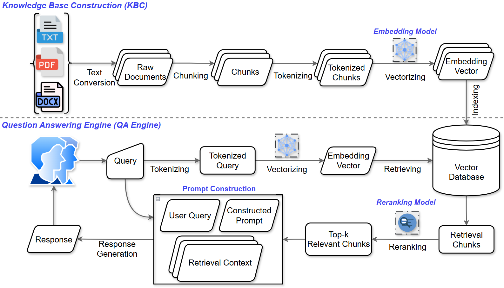

# ViSecRAG

## Giới thiệu

**ViSecRAG** là một hệ thống Retrieval-Augmented Generation (RAG) được thiết kế để xử lý và truy xuất thông tin bảo mật với tiếng Việt. Dự án tích hợp các kỹ thuật tiên tiến về chunking dữ liệu, tìm kiếm ngữ nghĩa, và tạo phản hồi thông qua mô hình AI.

### Kiến trúc hệ thống


## Tính năng chính

- **Xử lý dữ liệu**: Chunking thông minh sử dụng semantic_chunkers
- **Lưu trữ vectơ**: Tích hợp Weaviate cho lưu trữ dữ liệu có cấu trúc
- **Xử lý tiếng Việt**: Hỗ trợ xử lý ngôn ngữ tiếng Việt với UnderTheSea
- **Mô hình tùy chỉnh**: Pipeline fine-tuning cho embedding và reranking models
- **API Client**: Giao diện client để tương tác với hệ thống

## Cấu trúc dự án

```
ViSecRAG/
├── README.md                       
├── figure/                         # Hình ảnh và tài liệu minh họa
└── src/
    ├── finetune_pipeline/
    │   ├── embedding_model.ipynb   # Fine-tuning mô hình embedding
    │   └── reranking_model.ipynb   # Fine-tuning mô hình reranking
    └── rag/
        ├── main.py                 # Điểm vào chính của hệ thống
        ├── config.py               # Cấu hình hệ thống
        ├── client.py               # Client để giao tiếp với Weaviate
        ├── chunking.py             # Xử lý chia nhỏ tài liệu
        ├── retrieval.py            # Module tìm kiếm thông tin
        ├── generation.py           # Module tạo phản hồi
        ├── tokenization.py         # Xử lý tokenization
        ├── requirement.txt         # Danh sách thư viện phụ thuộc
        ├── test.ipynb              # Test và démonstration hệ thống
        └── ViSecRAG.ipynb          # Notebook chính của hệ thống
```

## 🚀 Hướng dẫn cài đặt

### Yêu cầu hệ thống
- Python 3.8+
- Weaviate instance (local hoặc cloud)

### Cài đặt thư viện

```bash
cd src/rag
pip install -r requirement.txt
```

### Các thư viện chính
- **semantic_chunkers**: Chia nhỏ tài liệu theo ngữ nghĩa
- **weaviate-client**: Client để kết nối Weaviate database
- **underthesea**: Xử lý ngôn ngữ tự nhiên tiếng Việt

## Cách sử dụng

### 1. Cấu hình hệ thống
Chỉnh sửa `config.py` để cấu hình:
```python
from config import Config

config = Config()
# Cấu hình database, mô hình, v.v.
```

### 2. Khởi tạo Client
```python
from client import Client
from config import Config

config = Config()
client = Client(config)
print(client.is_ready)  # Kiểm tra kết nối
```

### 3. Tạo Schema
```python
client.create_schema(config.cluster_name)
```

### 4. Tải dữ liệu
```python
from chunking import process_data

chunks = process_data("path/to/corpus")
client.upload_data(config, chunks, config.cluster_name)
```

### 5. Truy xuất thông tin
```python
from retrieval import retrieve

results = retrieve(query="Câu hỏi của bạn")
```

### 6. Tạo phản hồi
```python
from generation import generate

response = generate(query="Câu hỏi", retrieved_docs=results)
print(response)
```

## Fine-tuning Mô hình

### Embedding Model
Mở `src/finetune_pipeline/embedding_model.ipynb` để fine-tuning mô hình embedding.

### Reranking Model
Mở `src/finetune_pipeline/reranking_model.ipynb` để fine-tuning mô hình reranking.

## Kiểm thử

Chạy các notebook kiểm thử:
```bash
# Test hệ thống
jupyter notebook src/rag/test.ipynb

# Notebook chính
jupyter notebook src/rag/ViSecRAG.ipynb
```

### Các module chính

| Module | Chức năng |
|--------|----------|
| `config.py` | Quản lý cấu hình hệ thống |
| `client.py` | Giao tiếp với Weaviate database |
| `chunking.py` | Chia nhỏ tài liệu theo ngữ nghĩa |
| `retrieval.py` | Tìm kiếm thông tin liên quan |
| `generation.py` | Tạo phản hồi từ tài liệu truy xuất |
| `tokenization.py` | Xử lý tokenization tiếng Việt |

## Ghi chú quan trọng

- Đảm bảo Weaviate instance đang chạy trước khi khởi động hệ thống
- Chuẩn bị dữ liệu corpus ở định dạng phù hợp trước khi tải lên
- Các mô hình được fine-tune nên được lưu và tái sử dụng
